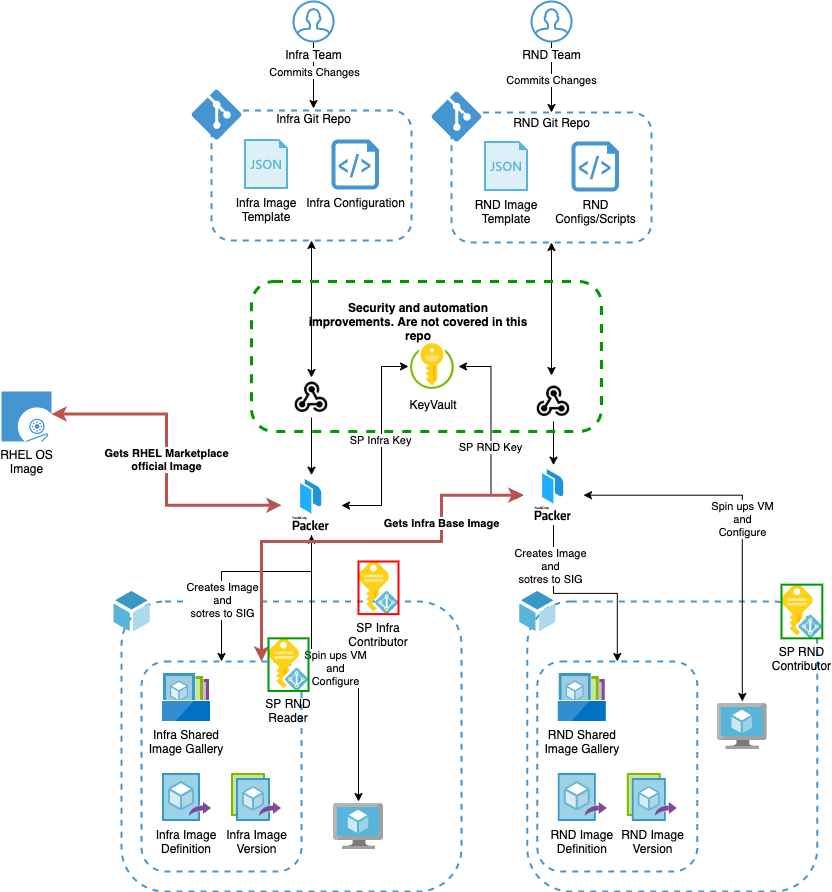

# Azure Shared Image Gallery
This setup covers the case when one department is responsible for the base image with hardening and tuning. Other departments of a company restricted to use the base image developing their own application, etc. 




# INFRA
In this scenario INFRA department is responsible for base image hardening, tuning, etc. It creates a company-wide standard image to be used by other departments and stores it in Azure Shared Image Gallery.

### 1. Create infra RG
```bash
infra_group_id=$(az group create -l eastus -n infra --query "id" -o tsv)
```

### 2. Create infra SP and save the output credentials
Packer authenticates with Azure using a service principal(SP). We'll need this credentials later. Please, save the output.
```bash
az ad sp create-for-rbac -n "infra" \
--role contributor \
--scopes ${infra_group_id} \
--query "{ client_id: appId, client_secret: password, tenant_id: tenant }"
```

### 3. Get Subscription ID
We'll need this id later. Please, save the output.
```bash
az account show --query "id"
```

### 3. Create Shared Image Gallery
```bash
infra_sig_id=$(az sig create --resource-group infra --gallery-name infraGallery --query "id" -o tsv)
```

### 5. Create image definition
```bash
az sig image-definition create --resource-group "infra" --gallery-name "infraGallery" --gallery-image-definition "Rhel-Infra" --publisher "Infra" --offer "RHEL" --sku "7.3" --os-type "linux"
```

### 6. Create Packer template for infra
See ```rhel-infra.json``` for reference

### 7. Create ```rnd-env.sh``` with proper env variables
```code
#!/usr/local/bin/bash

echo "Unset variables..."
unset ARM_CLIENT_ID
unset ARM_CLIENT_SECRET
unset ARM_SUBSCRIPTION_ID

unset ARM_RESOURCE_GROUP
unset GALLERY_NAME
unset IMAGE_NAME


echo "Set variables..."
export ARM_CLIENT_ID="<paste client id from the sp output here>"
export ARM_SUBSCRIPTION_ID="<paste subscription id here>"
export ARM_CLIENT_SECRET="<paste secret from sp output>"

export ARM_RESOURCE_GROUP="infra"
export GALLERY_NAME="infraGallery"
export IMAGE_NAME="Rhel-Infra"

```
```bash
chmod +x rnd-env.sh
```

### 8. Source env variables and run packer
```bash
. ./infra-env.sh && packer build rhel-infra.json
```


# RND
In this scenario, RND department develops an application. Company policies restrict usage of any other images rather than approved INFRA image.

### 1. Create RND RG
```bash
rnd_group_id=$(az group create -l eastus -n rnd --query "id" -o tsv)
```

### 2. Create RND SP and save the output credentials
Packer authenticates with Azure using a service principal(SP). We'll need this credentials later. Please, save the output.
```bash
az ad sp create-for-rbac -n "rnd" \
--role contributor \
--scopes ${rnd_group_id} \
--query "{ client_id: appId, client_secret: password, tenant_id: tenant }"
```
### 3. Assign RND SP 'Reader' role for Infra Shared Image Gallery 
```bash
az ad sp create-for-rbac -n "rnd" \
--role reader --scopes ${infra_sig_id}
```

### 3. Get Subscription ID
We'll need this id later. Please, save the output.
```bash
az account show --query "id"
```

### 3. Create RND Shared Image Gallery
```bash
az sig create --resource-group rnd --gallery-name rndGallery
```

### 5. Create image definition
```bash
az sig image-definition create --resource-group "rnd" --gallery-name "rndGallery" --gallery-image-definition "Rhel-Rnd" --publisher "RND" --offer "RHEL" --sku "7.3" --os-type "linux"
```

### 6. Create Packer template for RND
See ```rhel-rdn.json``` for reference

### 7. Create ```rnd-env.sh``` with proper env variables
```code
#!/usr/local/bin/bash

echo "Unset variables..."
unset ARM_CLIENT_ID
unset ARM_CLIENT_SECRET
unset ARM_SUBSCRIPTION_ID

unset ARM_RESOURCE_GROUP
unset GALLERY_NAME
unset IMAGE_NAME

unset BASE_IMAGE_SIG_RG
unset BASE_IMAGE_SIG
unset BASE_IMAGE_NAME
unset BASE_IMAGE_VER

echo "Set variables..."
export ARM_CLIENT_ID="<paste client id from the sp output here>"
export ARM_SUBSCRIPTION_ID="<paste subscription id here>"
export ARM_CLIENT_SECRET="<paste secret from sp output>"

export ARM_RESOURCE_GROUP="rnd"
export GALLERY_NAME="rndGallery"
export IMAGE_NAME="Rhel-Rnd"

export BASE_IMAGE_SIG_RG="infra"
export BASE_IMAGE_SIG="infraGallery"
export BASE_IMAGE_NAME="Rhel-Infra"
export BASE_IMAGE_VER="1.0.0"
```
```bash
chmod +x rnd-env.sh
```

### 8. Source env variables and run packer
```bash
. ./rnd-env.sh && packer build rhel-rnd.json
```


# Useful links
* https://www.packer.io/docs/builders/azure/arm
* https://github.com/hashicorp/packer/blob/master/examples/azure/
* https://www.hashicorp.com/resources/building-a-golden-image-pipeline-with-hashicorp-packer-and-azure-devops/
* https://docs.microsoft.com/en-us/azure/virtual-machines/linux/shared-image-galleries
